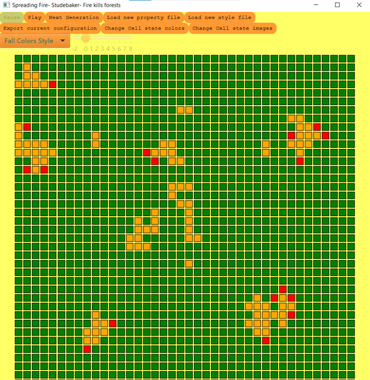

simulation
====

This project implements a cellular automata simulator.

Names:
Justin Lorenz 
Grace Llewellyn 
Luisa Silva 

Refactored alone by: Grace Llewellyn

### Running the Program
####  Instructions
NOTE: This readme is a work in progress along with this project
0. Download OpenJDK **full** package [here](https://bell-sw.com/pages/downloads/#/java-14-current). Download OpenJFX [here](https://openjfx.io/). 
1. Clone the git repository at [github.com/gllewellyn19/simulation](https://github.com/gllewellyn19/simulation)
2. Open your terminal and navigate into the cloned repository
3. Run `cd out/artifacts/simulation_jar`
4. Run the command: `java -jar simulation.jar`
5. Upload simulations by clicking the "Load new properties file" button and going to the root directory-> src-> resources-> sampleSimulations and choosing any of the files with a .sim extension. You can upload a style properties file by clicking the "Load new style file" button and going to the root directory-> data -> StyleProperties and choosing any of the files with a properties extension. You can change a cells state by clicking on it. Play the simulation by clicking any of the buttons at the top of the GUI.

#### Adding a new simulation
For a new simulation we need a .sim property file with the following specifications:

* Simulation Type (ex: Percolation)
* Title Of Simulation: will appear on javaFx window header (ex: FreeFlowing)
* Author: will appear on javaFx window header together with title (ex: John Smith)
* Description: description of simulation, that will also appear on javaFx window header (ex: Water is flowing )
* InitialConfiguration: path to csv file that contains initial configuration of the simulation (ex: data/TestingCSV/PercolationTest.csv)
* Number of States (ex: 3)
* Neighbor Type (ex: Square)
* Edge Type (ex: Finite)

#### Creating a style properties file
We also need property file to define some style elements for the graph simulation like 
 (if none is specified the default value will be used)
StateColor+ stateNum (ex StateColor0=WHITE or white or hex)
ImagePath + stateNum (ex ImagePath0=cellimages/sadFace.jpg)
GridOutlined (Yes or no)
Language (ex English, Spanish)

### Notes/Assumptions

Assumptions or Simplifications:

Notes about Properities files describing game. Put the game name in camel case and should exactly match the name of the Cell designed to implement that game (minus the word Cell. For example, GameOfLife as the simulation name would match GameOfLifeCell).  File name should be path not in quotes and relative to simulation_team19. On and off colors should be in all capitals 
The Cell that the user implements should be in src/cellsociety/Model/GameCells

Only image file types accepted are jpg, png, gif, and bmp because these are the only image types accepted by the java image class

InitialConfiguration- either a csv file, "Random:numRows,numCols" for a random generation, or "Checkered:numRows,numCols" for a board that oscillates between the states (best results if odd number of rows and columns)

How to add a new language: Create a language file with .properties and put it in src/resources/languages then add the option to the language button as the name of the language file.  Also, create language + Exceptions.properties and save it in src/resources/exceptions. The language files needs to contain all necessary keys which can be found in any of the existing language and exception properties.

We only look at the data in the csv that is inside the bounds of the given row and column range. This gives the user greater flexibility because they can modify the row and column range for the same csv file

How to match color of graph and squared simulation: specify the same state color for both .sim file and css graph style file, by
first specifying color of of states on .sim property file and then match it by specifying the same
colors for the css file for graph.

Where files css files are located: add new css File for new simulation on Resources -> Stylesheets folder

Where files .sim files are located:.sim property files are located in resources folder

Where language css files are located: resources -> languages folder

Where exceptions property files are located: resouces -> exceptions

Where files used for testing are located: resources -> TestingPropertiesFiles

### Primary Roles in the original project
* Grace:
	* Worked on both the front end and the back end of the project
		* Did almost all of the buttons and their functionality as well as the the buttons maintainer class
		* All testing for buttons and DataReader and Missing game properties
		* Created abstract design for buttons
		* Errors checks for invalid and missing properties (custom exceptions)
		* Made sure that all exceptions being thrown were caught and the correct message happened
		* Created interfaces for the project and has classes implement them
		* Created ability to change languages in the project (including exceptions)
		* Created different starting configurations for the file
		* Dealt with many small bug fixes through FIXME tags
		* Created splash screen for project and changing CSS files
		* Optional style properties files

* Justin:
    * Focused primarily on implementing the model part of the program
        * Created the Cell classes as well as the rules that run the simulations
        * Created the different types of edges
        * Created the different types of neighbors
        * Created the Board Structure and ModelBoard implementation
    * Helped out in other parts of the program where need be: gameview, buttons, controller, etc.
    * Created tests for model and display board 

* Luisa: 
    * Data Reading class: placing board out of csv file
    * Exception handling and made new custom exceptions and testing for them:
        * ModelException
        * Missing file path exception
    * Controller class tests
    * Linegraph class and implementation with its tests
    * css file reading for linegraph
    * Refactoring