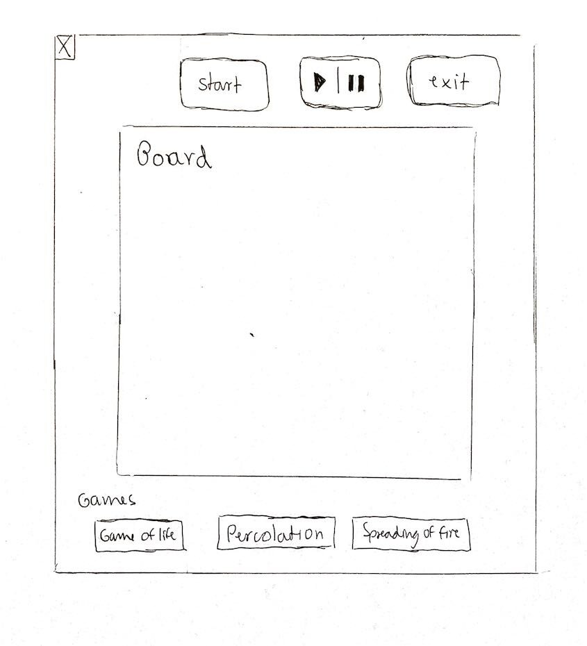

# Simulation Design Plan
### Team Number: 19
## Names and NetIDs
Justin Lorenz (jml166)
Grace Llewellyn (gal16)
Luisa Silva (lps23)

## Design Overview

For our design, we want to follow the model, view, controller format where the model will store the data of the simulation such as the states of the cells, the grid, etc, the view will hold the ability to display the GUI and view that the user will be seeing, and the controller will be the “middle-man” between the two classes are do things such as tell the view to display something different if the model has changed. The way we plan on continuously updating our program is by having the controller check if a new update needs to happen. If this is true, the controller will let the model know to update its data, and then once this is designed, the view will know to update its view based on this changed data. We are planning on following this plan because the MVC model allows the program to be more flexible and have less dependencies between classes. 

## Design Details

Class One: Board Class
* Constructor(int rows, int cols)
    * Create a new curr board and prev board of size rows * cols 
* Public void changeBoardGeneration() 
    * Changes the board to the next generation using the current Cell’s game rules
* Public void initializeBoard(Cell[][] board)
    * Initializes the board to of a specific type of cell that user wants (i.e gameOfLifeCell would be a subclass of cell with method that holds game of life rules)
* Public int getAliveNeighborCount(int i, int j, Cell[][] oldboard)
    * Given a cell’s coordinates, find the number of neighbors that are alive
* Public void cloneboardover(Cell[][] newboard, Cell[][] cloneboard)
    * Clones the cloneboard into newboard

Use Cases:
* Constructor: the constructor will be used to create and initialize the game board
* ChangeboardGeneration(): will be called by the controller to update every tick of the game and update the cell’s states based off the given game rules
* InitializeBoard(): used to set the cell type for the game and initialize the boards of the game
* getAliveNeighborCount: will be called by each cell in the board to get the alive neighbors around that cell and then that cell will use the neighbors to determine its new state
* Cloneboardover: this method will be called every time we want to change the board to a new generation or new board. The main reason this is needed is that when going to next generation, you must not modify the original board you sent in

Class Two: Cell
* Constructor(int coordinate_x, int coordinate_y)
    * Return new  cell with coordinates x and y
* Contructor2(int coordinate_x, int coordinate_y, boolean state)
    * Return new cell with coordinates x and y and state true or false (1 or 0)
* SetState( boolean new_wanted_state)
    * Turn previous state into new state for cell
* GetState()
    * Return current state of cell (true/false)
* getStateInteger()
    * If state is true return 1 and if state is false return 0
* nextGenerationRules( int alive_neighboors)
    * Abstract method that will change the cell to its next generation depending on game rules 

Use cases:
* The Constructor() will be used to initialize the Cell that will be located in the Board
* The Constructor2() will be used to initialize the Cell that will be located in the Board (with a chosen state, true or false)
* SetState() will be used to set the state of a cell to true or false depending on the inputted new_wanted_state
* GetState() is used to get the state of the cell it’s called on
* getStateInteger() turns the state of the cell from false and true to 0 and 1
* nextGenerationRules() is the method that will be overridden on the classes that extend Cell class to change the rules of the game being played

Class Three: DisplayBoard
* Constructor(int rows, int cols)
    * Creates a display board of a shape such as square that is the same size as the model’s board size
    * Constructor will also grab the resource properties that are needed to make the board look nice such as the on and off colors, the border colors
* Public void Display()
    * This method will loop through the 2D display array and check the corresponding gameboard cell’s state. If the state is true, change the color of the square to a on color like black, if dead cell then change color to off color like white

Use Cases:
* Constructor: will be called by the controller to set up the display that the user will be seeing
* Display: will be called by the controller to display the current cell states of the game using the model data set in

Class Four: GameView 
* Constructor()
    * Creates a new layout to host all the elements of our view, some examples would be buttons, the disp board, text, etc.
    * The constructor will also grab the resource properties sent in to change the style of the view such as the button colors, the text colors, etc.
* InitializeButtons()
    * Method that will initialize the buttons that are used in our game such as the pause next generation buttons
* Boolean ButtonPressed()
    * Method that checks if a button is pressed in the game. The gameview should send in true or false to the controller to see whether the game needs to update such as pause, stop, advance a generation, etc.
* Scene makeScene(int width, int height) 
    * Returns a new scene to be added to the stage to be viewed.

Use Cases:
* Constructor: This game view constructor will be called when the game is first made to initially set up the view and all the components that will go into the GUI that the user sees.
* InitializeButtons(): This method will be used to initialize the buttons to their starting states and allow the game to be ready for user input
* ButtonPressed(): This method will take care of finding the time the user inputs an action into the game and lets the controller know to do a certain action like pause, save, update model, etc.

Class Five: BoardReader 
* readData(csv file) (we are assuming we can only work with csv files for now)
    * Return an Array of 1s and 0s depending on the value on the csv file.

Use cases:
* The readData() method will be used to read the cell layout out of a csv file and turn it into a more usable format for the code (int array)

Class Six: Controller

* Constructor(int[][] array ) - array that is created by calling readData() method on BoardReader class
    * Returns new Board
* updateBoard() - update new board out of previous board from Board class. 

Use cases:
* The Constructor( ) method will be used to create a new Board object out of the information read out of the csv file.
* updateBoard() is the  method in the controller class that will link the change of board generation on the model and view class.

## Design Considerations

Design issue 1: We are not sure the classes we need and the ones we won’t have a use for in the future. A good example is the dilemma we had with the Coordinates class as we are not sure it would be a necessary class for our code. We thought about how the coordinates of the cell can be handled directly by the cell itself, but at the same if we ever need to get the coordinates of a specific cell in a board we could use methods inside a Coordinate class (such as getters and setters).

Design issue 2: How we are going to change the cell’s from one game to another more easily without too many changes in the code. For example, in initializeBoard methods in Board class we plan on having a single line that needs to be changed to change the game to different games (which have different rules). The advantage is that changing just one line of code to change the game is very simple. The disadvantage is that the user needs to read the code and find the line in Board class that needs to be changed in case he is playing another game.

## User Interface

Here is our amazing UI:

## Team Responsibilities

Luisa:
Focus on front end of the code. Involving work on the layout of the simulation on javaFx, work on buttons, display of the grid, display of different cells for different games, create csv files, work on test for the view part of our classes. Also work on planning the next steps for the design, don’t miss meetings and etc.

Grace:
Grace is going to work on connecting the front end to the back end of the project. We are all going to equally split testing (and test our own parts). Grace is going to handle the to do list of the project and work on numerous small things. Grace will show up to all meetings and organize meetings as she sees fit. Grace is also going to focus on the buttons 

Justin:
Justin is going to focus on the backend development of the project. This would involve the model part of the game such as the data that is being updated in the board, in the cells, data being read in from different files, the rules of the games, etc. 

Everyone’s Responsibilities:
Every person is going to make sure to focus on testing their own files as well as helping out each other on other parts of the project when needed. We also will all make sure to show up to the team meetings and make sure to continuously contribute to the group.

    